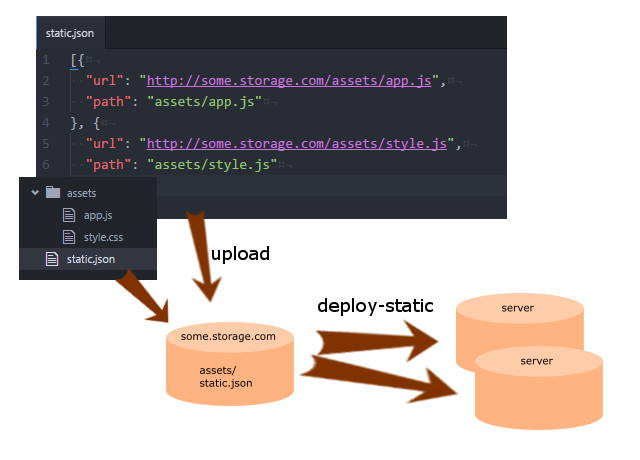

deploy-static
===


This is a command built with Node.js to facilitate deployment of static
files.

Installation
---
``` sh
$ npm i deploy-static -g
```

Usage
---
Before deployment, you should upload your static files somewhere and
build a list in `static.json`.

`static.json` is like this:

``` json
[{
  "url": "http://my.storage.com/assets/app.js",
  "path": "assets/app.js"
}, {
  "url": "assets/app.css",
  "path": "assets/app.css"
}]
```

Each item has an `url` to fetch and local `path` to store. `url`s can
be both absolute or relative paths.

Then deploy your static files with the command below.

``` sh
$ deploy-static fetch static.json -t v1.0 -p http://my.storage.com/
```

After that you will get directory architecture like this:

```
▾ ./
  ▸ current/ -> versions/v1.0/     # symlink to current version
  ▸ versions/
    ▸ v0.8/
    ▸ v0.9/
    ▸ v1.0/                        # latest version
```

The latest version will be linked to `./current` while the history
versions are kept in `./versions` so that you can easily rollback.

Note that if the `url` is relative, the `prefix` parameter must be
assigned. `static.json` is also an `url`, either absolute or relative.

Documents
---

* deploy-static fetch

```
usage: deploy-static fetch [-h] [-d DIST] [-t TAG] [-f] [-p PREFIX] [-S] [static]

Positional arguments:
  static                the URL or path of static.json, stdin will be read if
                        none is provided

Optional arguments:
  -h, --help            Show this help message and exit.
  -d DIST, --dist DIST  the directory to hold the static files
  -t TAG, --tag TAG     the tag of current version, will be used as the
                        subdirectory name, default as current date
  -f, --force           whether to reuse files in an existed tag
  -p PREFIX, --prefix PREFIX
                        the URL prefix for all items with relative paths
  -S, --save-static     whether to store the static.json file
```

* deploy-static link

```
usage: deploy-static link [-h] [-d DIST] tag

Positional arguments:
  tag         the tag or folder name of the version to be linked

Optional arguments:
  -h, --help  Show this help message and exit.
  -d DIST, --dist DIST  the directory to hold the static files
```

* deploy-static clean

```
usage: deploy-static clean [-h] [-d DIST] [-t TAG [TAG ...]] [-n NUMBER]
                           [-k KEEP] [-N]


Optional arguments:
  -h, --help            Show this help message and exit.
  -d DIST, --dist DIST  the directory to hold the static files
  -t TAG [TAG ...], --tag TAG [TAG ...]
                        Remove obsolete versions by tags.
  -n NUMBER, --number NUMBER
                        Remove the first NUMBER of obsolete versions. If
                        value not provided, the first one will be removed.
  -k KEEP, --keep KEEP  Remove obsolete versions and keep last KEEP ones. If
                        value not provided, the last 4 will be kept.
  -N, --dry             Show versions to be cleaned and exit.
```


